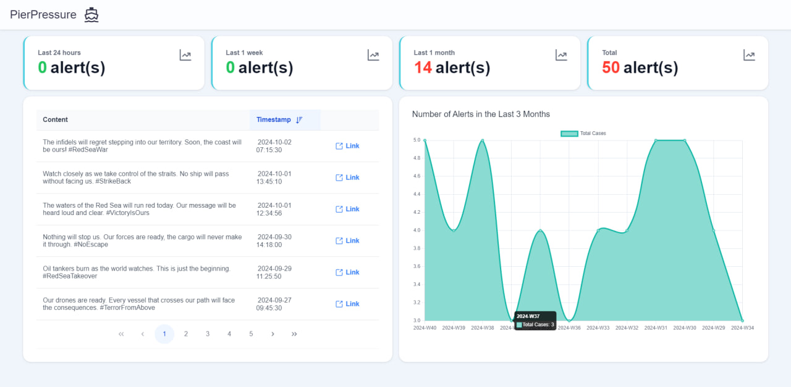

# PierPressure - Early Threat Warning System

_PSA Hackathon: Code Sprint 2024_

## Team Name: PierPressure

**Theme 1: Resilient Port Operations Globally**

### Project Overview

As global port operators and supply chain solutions providers, PSA faces growing challenges in maintaining resilient
port operations due to unpredictable threats such as the Red Sea crisis. These volatile events call for innovative and
AI-driven solutions to optimize port resilience and efficiency across the global network.

### Objective

The objective of this project is to develop an **Early Threat Warning System** that identifies potential sea-based
threats (such as terrorist activities or other disturbances) before they happen, enabling preemptive actions.



---

### Key Features

| Feature                                 | Description                                                                                                                       |
| --------------------------------------- | --------------------------------------------------------------------------------------------------------------------------------- |
| **Automated Web Scraper**               | Collects real-time data on sea and terrorist threats through social media platforms.                                              |
| **Training Large Language Model (LLM)** | Uses an LLM to analyze incoming data from the web scraper and detect patterns that could signify potential threats.               |
| **Sentiment Analysis of Live Tweets**   | Evaluates public sentiment in real-time to help identify possible threats through social media platforms.                         |
| **Smart Dashboard**                     | Provides a centralized interface for visualizing detected threats, with alerts to notify decision-makers of high-risk situations. |

### System Workflow

1. **Data Collection**: Real-time data is scraped from social media platforms to identify mentions of potential threats
   in maritime regions.
2. **Data Processing**: The scraped data is analyzed using a pre-trained LLM to detect patterns or key phrases
   associated with terrorist threats or attacks.
3. **Sentiment Analysis**: Tweets and social media posts are evaluated for sentiment, identifying early signs of fear,
   tension, or unrest.
4. **Threat Visualization**: The dashboard displays the results, with clear alerts and threat levels to help port
   operators respond quickly.

---

### Technology Stack

- **Web Scraper**: Selenium
- **Language Model**: LLama 3
- **Database**: Firestore Database
- **Dashboard**: HTML, CSS, TypeScript, Angular

---

### Get Started Guide

#### Step 1: Pre-requisites

- Ensure your system has docker installed.
- All command lines will be ran in the root directory of this project folder, more specifically, the folder where docker-compose.yml file can be found.

#### Step 2: Build the Docker containers

```bash
docker compose build --no-cache
```

#### Step 3: Run the Docker containers

```bash
docker compose up -d
```

> Note: This process might take a few minutes, depending on internet connection speed, as the the container needs to install the libraries required.

#### Step 4: Access the dashboard

- Open your browser and go to `http://localhost:4200/`. You will be directed to the login page. Sign up using an email and password to view the dashboard.

#### Step 5: Stop the containers

Once done with the testing, feel free to stop the container.

```bash
docker compose down -v
```

### Others

| Folder / File                                                         | Description                                                                         |
| --------------------------------------------------------------------- | ----------------------------------------------------------------------------------- |
| **./LLM Model and Scripts/Llama3_tweet_classification.ipynb**         | Uses fine-tuned Llama 3 model to classify clean content (tweets).                   |
| **./LLM Model and Scripts/Llama3_finetuning/Llama3_finetuning.ipynb** | Model after fine-tuning.                                                            |
| **./LLM Model and Scripts/all predictions**                           | A folder containing all excel file for all predictions(both positive and negative). |
| **./LLM Model and Scripts/positive predictions**                      | A folder containing all excel file for all positive predictions.                    |
| **./LLM Model and Scripts/cleaned tweets**                            | A folder containing all excel files of scraped tweets after cleaning.               |
| **./LLM Model and Scripts/tweets**                                    | A folder containing all excel files of scraped tweets.                              |
| **./LLM Model and Scripts/app.py**                                    | A script for writing into Firestore Database.                                       |
| **./LLM Model and Scripts/Twitter_scraper.ipynb**                     | Used for scraping tweets based on keywords.                                         |
| **./frontend**                                                        | A folder containing all the files related to the web application.                   |

### Team

- **Team Name**: PierPressure
- **Members**: Carl, Hari, Nigel, Khoon Sun

---
